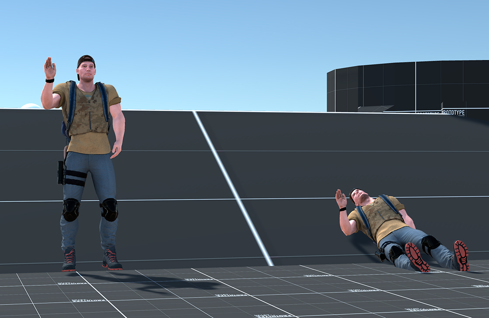
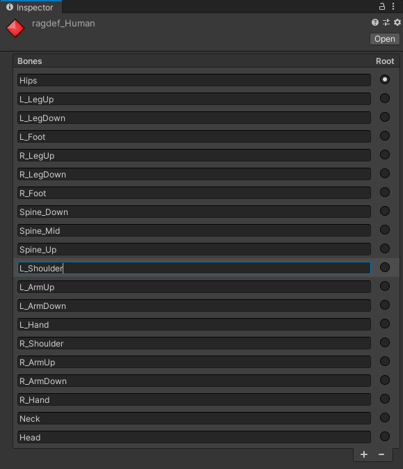
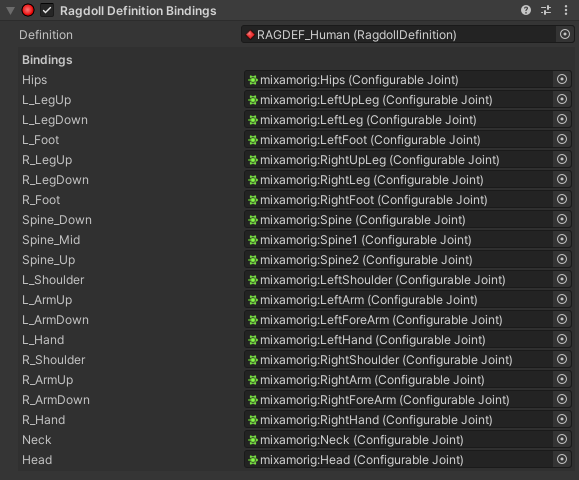
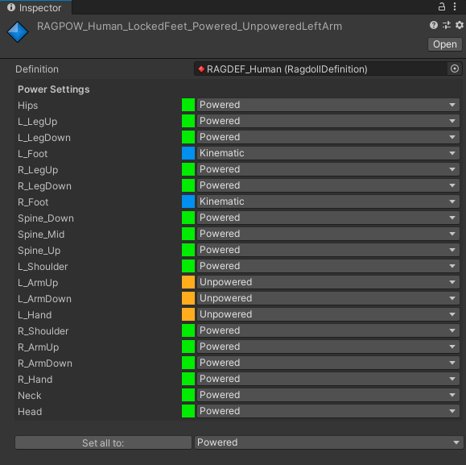
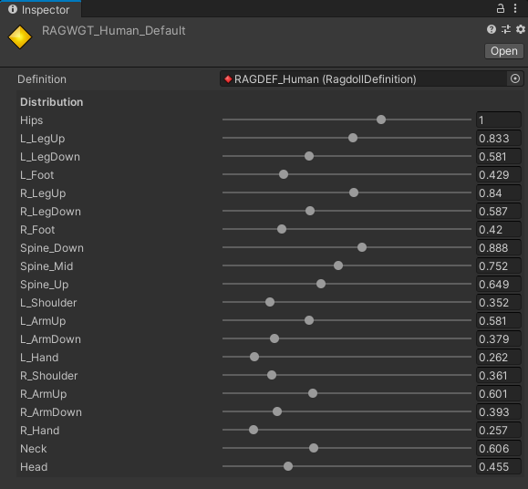
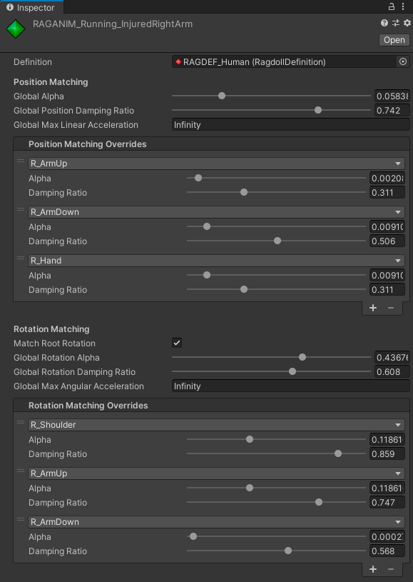
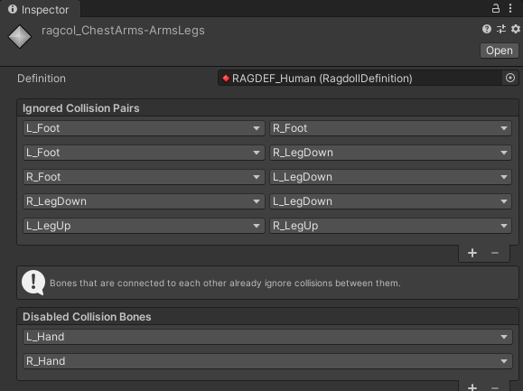
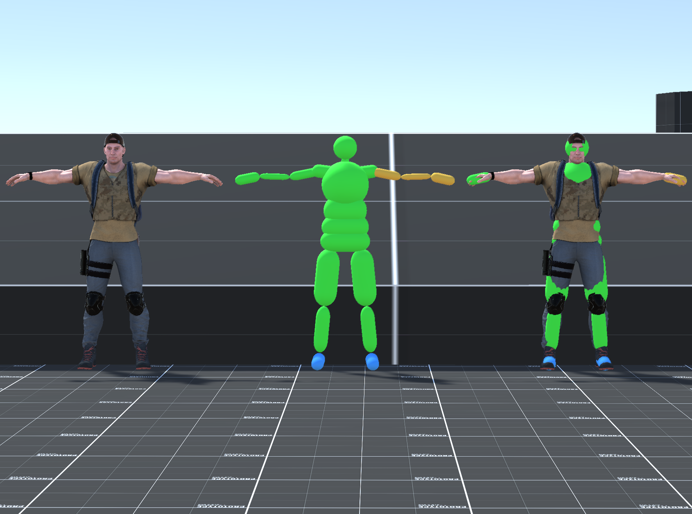
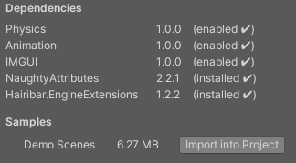

# Hairibar.Ragdoll
A Unity package for making ragdolls and animating them with keyframed animations. See it in action at https://youtu.be/ByNPbbACf40.

- Allows keyframed animations to be affected by physics.
- **Animator-friendly** parameters.
- **Partial ragdolls**: enable simulation on some bones and leave others purely keyframed.
- **Transparent**: acts as a post-processing effect on your animation. Your game code doesn't even need to know about it.
- Compatible with virtually any animation system.

# Table of Contents
- [Overview](#Overview)
- [Animation Matching](#Animation-Matching)
- [How to make an animated ragdoll](#How-to-make-an-animated-ragdoll)
- [RagdollDefinitions and Ragdoll Profiles](#RagdollDefinitions-and-Ragdoll-Profiles)
- [Components of interest](#Components-of-interest)
- [API](#API)
- [Samples](#Samples)
- [General tips](#General-tips)
- [How to install](#How-to-install)
- [License](#License)

# Overview
Hairibar.Ragdoll works by keeping two versions of the character's bone hierarchy. The *Target*, which is animated by Unity and has a mesh, and the *Ragdoll*, which has no visual representation. 

Every physics step, appropriate forces are applied to the *Ragdoll* so that it follows the *Target* animation (this is referred to as Animation Matching). Every frame, just before rendering, the *Target* bones are moved to the pose of the *Ragdoll* bones, effectively rendering the *Ragdoll*.

This approach makes it easy to add ragdoll effects, as no changes to the existing hierarchy are needed. The ragdoll effect works like a post-processing effect applied to the animation.

# Animation Matching
## Position and Rotation Matching
The *Target* position and rotation are matched separately. Position and rotation matching can be configured/enabled/disabled independently. Position is matched in world-space, while rotation is matched in the local space of each bone.

Matching position in world space makes *Ragdoll* bones easily line up with the *Target* bones. 

Matching rotation in local space allows the *Ragdoll* to attempt to match the *Target* pose, but allows this pose to be deformed by forces, collisions etc. 


**Left**: a character with Position and Rotation Matching. 
**Right**: a character with only Rotation Matching.

In most cases, you'll be using both matching types at the same time.

## Parameters
Animation Matching forces are calculated via springs, but the usual *k* and *d* parameters are replaced with easier alternatives:

### Alpha
A value from 0 to 1. A *Ragdoll* bone with alpha=1 will take one physics step to reach the *Target* pose. With alpha=0.5, it will take two steps, etc.

Alpha controls the stiffness of the springs, and can be thought of as a blend between animation and physics. 

- Alpha=0: physics.
- Alpha=1: animation.

It's worth noting that alpha is most expressive at its low end. 0.01 and 0.1 look very different, but 0.1 and 1 look almost identical. To prevent stability problems, if you can't see the difference between two values, favour the lowest one.

### Damping ratio
A value from 0 to 1. Describes the damping behaviour of the spring.

- Ratio of 0: no damping.
- Ratio of 1: the exact amount of damping so that no oscillations happen.
- Ratio between 0 and 1: progressively less oscillations.

The damping ratio can be thought of as a wobble control. This can be very useful for achieving secondary motion without having to animate it.

# How to make an animated ragdoll
A wizard is included to guide you in the process of making a ragdoll.
This wizard can be found at the menu bar: *Tools/Hairibar.Ragdoll/Animated Ragdoll Wizard*.

Select your current character GameObject (this will typically be where your Animator component is) and open the wizard to start the process. 

Here are the steps that the wizard will take you through:

## Hierarchy copy
A copy of your character will be created. The existing version will be the *Target* (nothing will changed in it). The new version, which will have all components removed, will be the *Ragdoll*.

## Add colliders
All 3D collider types are supported. A bone can have any number of colliders, including zero.

As a general rule, tend to make colliders bigger than the visual body part. Don't worry about overlapping some colliders (this always happens around the chest area); you'll get a chance to [selectively ignore collisions](#RagdollCollisionIgnorer) later.

You can create a child and put the collider there if you need the local offset. This can be useful if you need a collider to be rotated relative to the bone it represents.

## Add ConfigurableJoints
In this step, a `ConfigurableJoint` must be added to each bone that you want to simulate.

### Omitting bones
Not all bones need to be simulated. For example, you should probably give the hands a `ConfigurableJoint` and skip the fingers. The fingers will still play their local-space animation; they will simply not be simulated and will move with the hand.

There is a single rule in terms of omitting bones: if a bone is omitted, all of its children must be omitted as well. In other words, to simulate a bone, all of its parents (up to the root bone) must be simulated as well.

### Configuring ConfigurableJoints
This part is not pretty. `ConfigurableJoints` are powerful, but poorly documented. If you don't understand a parameter, [this thread](https://forum.unity.com/threads/configurable-joints-in-depth-documentation-tutorial-for-dummies.389152/) has the best writeup I know of.

Here are the things you need to configure for each bone:
- Assign the `connectedBody` (for a given bone, this will be their parent). The root bone's `connectedBody` should be null.
- Set the anchor. Unless you're doing something very specific, you can just set `autoConfigureAnchor` to true.
- Set the axes. This is the hard part. Read the thread, have patience and maybe set up a test case with two bodies so that you can do some experiments. Also, try using the [samples](#Samples) as reference.
- Set the motion limit types. In most cases (including human characters), all joints (except the root) should have their motion axes locked and their angular motion axes limited; though this is not a requirement. The root joint should have all 6 axes set to Free (this **is** a requirement).
- Set the angular limits (and motion limits if you're not locking them).

Don't bother changing any other parameters! (This includes the `Rigidbody`). Many of them will be overwritten at runtime/controlled by [RagdollSettings](#RagdollSettings) and [RagdollAnimator](#RagdollAnimator). Also, breaking joints is not supported.

## Profile creation
A default set of [Ragdoll Profiles](#RagdollDefinitions-and-Ragdoll-Profiles) will optionally be created for this ragdoll. 
If this ragdoll will share an existing definition, assign the definition instead.

At this point, several components will have been added to the *Target* and the *Ragdoll*, and everything will be set up. Read more about these components [here](#Components-of-interest).

# RagdollDefinitions and Ragdoll Profiles
Hairibar.Ragdoll uses a bunch of `ScriptableObjects` (referred to as *Ragdoll Profiles*) to manage configuration in a reusable and swappable way. To refer to specific bones, these profiles use `RagdollDefinitions`. 

A `RagdollDefinition` keeps a list of the bones present in a ragdoll. 


Any ragdolls that have this same list of bones can share this `RagdollDefinition`, and thus share any *Ragdoll Profiles*.

# Components of interest
## RagdollDefinitionBindings
Placed on the *Ragdoll*, `RagdollDefinitionBindings` binds a `ConfigurableJoint` to each bone name in the definition.

This bridges the gap from the bone names found in *Ragdoll Profiles* to actual GameObject references.

This component is always required.



## RagdollSettings
Placed on the *Ragdoll*. Provides a centralised place to configure the `Rigidbodies` and `ConfigurableJoints`. Most settings have tooltips explaining what they do (the rest are hopefully self-evident).

When changing any fields from code, `RagdollSettings.ApplySettings()` must be called.

There are properties for two *Ragdoll Profiles*.

### RagdollPowerProfile
`RagdollPowerProfiles` allow individual bones to be configured as simulated/not simulated.

Each bone can be in one of three states:
- **Kinematic**: the bone is not simulated, it follows the *Target* animation perfectly. Its `Rigidbody` will be made kinematic.
- **Powered**: the bone is simulated, and Animation Matching forces are applied to it.
- **Unpowered**: the bone is simulated, but no Animation Matching forces are applied.



### RagdollWeightDistribution
Weight distribution can greatly affect how unpowered ragdolls behave. 

The total mass of the ragdoll will be the value of `RagdollSettings.totalMass`. 
`RagdollWeightDistributions` allow you to control how this mass is distributed between the *Ragdoll* bones.



Generally speaking, making bones around the center of mass heavier than the extremities is a good starting point.

## RagdollAnimator
Placed on the *Target*. It will generally be alongside an `Animator`, but it doesn't have to be. Remember, any animation system that positions the bones before `RagdollAnimator.LateUpdate()` every frame will be compatible.

`RagdollAnimator` is the key component of Hairibar.Ragdoll, as it is in charge of Animation Matching. 

It has two master values for alpha and the damping ratio, which are handy for quick experiments. For actual production use, `RagdollAnimationProfiles` should be assigned.

When switching between `RagdollAnimationProfiles`, their values will be transitioned between.

### RagdollAnimationProfiles
These objects define values for alpha and damping ratio. Position and rotation matching are configured separately. There are global values for both.

By default, RagdollAnimationProfiles aren't definition-specific, as they don't refer to specific bones. A `RagdollDefinition` can be assigned, which allows the global values to be overridden by bone-specific values.



There's a checkbox for matching root rotation. [Rotation is matched in local space](#Position-and-Rotation-Matching), but, as the root's local space is the same as world space, it's a somewhat special case.

Matching root rotation makes it so that the ragdoll keeps the general orientation of the target. Not matching it allows it to deviate from this orientation. Different gameplay scenarios and setups may need one behaviour or the other.

## RagdollCollisionIgnorer
Sometimes, collisions can be problematic. An animation might require to put a hand inside a pocket—but collisions might not allow this to happen.

`RagdollCollisionIgnorer` is an optional component that is placed on the *Ragdoll*. It applies the ignorance settings defined in `RagdollCollisionProfiles`.

### RagdollCollisionProfiles
These profiles allow you to ignore collisions in two different ways.

1. You can ignore collisions between two specific bones. (In our example, we would ignore collisions between R_Hand and R_LegUp).
2. You can outright disable all collisions for a given bone. Note that this is implemented through `Rigidbody.detectCollisions`. The `Colliders` themselves will not be disabled, which is subtly different.



## RagdollCollisionReaction
When there's a collider between the *Ragdoll* and the *Target* position matching might cause the *Ragdoll* to vibrate. `RagdollCollisionReaction` prevents this by temporarily lowering the colliding bones' alpha.

`RagdollCollisionReaction` is an optional component that is placed on the *Target*.

## RagdollPowerOnTransitioner
When instantiating a character, it will often snap to a pose. This can also happen when switching *Power Profiles*.

If these sudden movements causes issues, add a `RagdollPowerOnTransitioner` to the *Target*. 

This component will gradually turn alpha up, preventing sudden movements from making the ragdoll unstable.

## RagdollColliderVisualizer
Placed on the *Ragdoll*, this component draws the ragdoll's colliders as opaque meshes. The colours match their power profile.




## Mecanim integration
While Hairibar.Ragdoll can work with systems other than Mecanim, it offers multiple `StateMachineBehaviours` that can come in handy: `SetRagdollAnimationProfileOnEnter`, `SetRagdollCollisionProfileOnEnter`, `SetRagdollPowerProfileOnEnter` and `SetRagdollWeightDistributionOnEnter`.

These behaviours allow you to tie specific *Ragdoll Profiles* to specific animation states, automatically switching between them.

# API
Hairibar.Ragdoll is divided in two modules: Core and Animation. Core implements the framework for working with ragdolls (`RagdollDefinitions`, `RagdollSettings`, etc). Animation builds upon this framework and implements the animation stuff.

Each module has their runtime assembly and their editor assembly.

## IBoneProfileModifier
This interface can be implemented to modify animation parameters at runtime. Just implement it in a component and put that component next to the `RagdollAnimator`.

You can take `RagdollCollisionReaction` as an example.

## ITargetPoseModifier
This interface can be implemented to modify the target pose that has been read from the animation system. Just implement it in a component and put that component next to the `RagdollAnimator`.

## Custom Ragdoll Profiles
There may be situations where you want your own reusable sets of parameters (for example, for configuring an `IBoneProfileModifier`).

Custom *Ragdoll Profiles* can easily be made by inheriting from `RagdollProfile`. This base class provides `RagdollDefinition` compatibility checks.

You can make a custom inspector by inheriting from `RagdollProfileEditor`, which makes it easy to add drag & drop support, for example.

`RagdollPowerProfile` and `RagdollPowerProfileEditor` are good straight forward examples.

# Samples
Hairibar.Ragdoll includes a set of demo scenes that you can use as examples to understand how to work with the package.

See [Importing the samples](#Importing-the-samples) for instructions on how to get these samples.

The samples require specific ProjectSettings to be in place in order to work. After you install the samples, press Tools/Hairibar.Ragdoll/Perform Demo Layer Setup to configure these settings automatically. 

**WARNING**: Tools/Hairibar.Ragdoll/Perform Demo Layer Setup will overwrite your current TagManager and DynamicsManager values. You will lose you layers, tags and physics settings. Either import the samples in a new project, or make a backup of your settings before importing.


# General tips
- Keep ragdolls in their own layer. This allows you to be selective as to what they collide with. You probably don't want ragdolls and navigation capsules interacting.
- Make test scenes! There's a lot of parameters to be tweaked in `RagdollSettings`. Set up specific situations, and tweak until you get the behaviour you want.
- If you see weird poses and are sure you `ConfigurableJoints` are correctly set up, collisions between body parts may be the culprit. Add a `CollisionSpammer` to every bone and they will log any collisions, allowing you to find and selectively ignore them.
- If your ragdoll irrecoverably blows up after large shocks, make sure that you're not using hard limits on your joint. Set `RagdollSettings.limitSpring` to anything over 0 to use soft joint limits instead. With soft joint limits, limits are enforced by a spring instead of being completely inelastic. This can make a huge difference on stability.

# How to install
Add the following dependencies to your manifest.json:
``` json
{
  "dependencies": {
    ...
    "com.dbrizov.naughtyattributes": "https://github.com/dbrizov/NaughtyAttributes.git#v2.0.7",
    "com.hairibar.naughtyextensions": "https://github.com/hairibar/Hairibar.NaughtyExtensions.git#v1.3.0",
    "com.hairibar.engineextensions": "https://github.com/hairibar/Hairibar.EngineExtensions.git#v2.3.0",
    "com.hairibar.ragdoll": "https://github.com/hairibar/Hairibar.Ragdoll.git#upm"
    ...
  }
}
```

This snippet will import Hairibar.Ragdoll and its dependencies to your project. For this to work, Git must be added to your system PATH (which is probably already the case).

## Dependencies
This package has two dependencies:
- [NaughtyAttributes (my personal fork) v2.2.1](https://github.com/hairibar/NaughtyAttributes)
- [Hairibar.EngineExtensions v1.2.2](https://github.com/hairibar/Hairibar.EngineExtensions)

## Importing the samples
After importing Hairibar.Ragdoll, find it in the package manager. There will be an "Import into project" button in the "Samples" section.



Make sure to read the instructions in [Samples](#Samples). 

# License
The package is released under the MIT license.
If you find it useful in a project, crediting me (Aitor Iribar) or the use of the package is appreciated! This is not legally required, mind you, partly because I don't trust myself to write a license of my own.

Also, ping me if you do use it! I'd love to know.